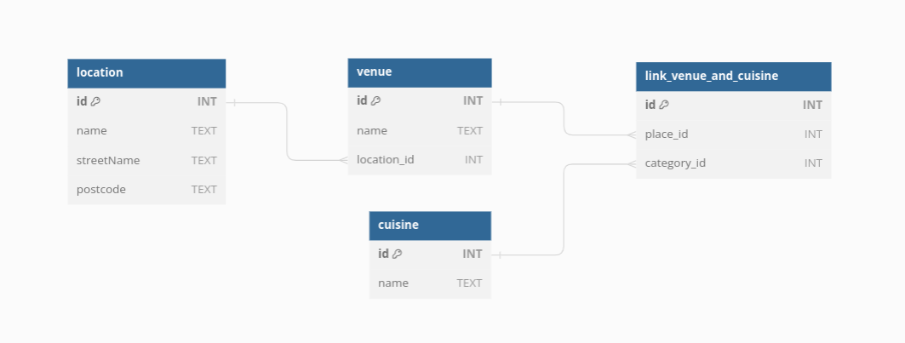

# db-issy-tess-tommaso-james

London Restaurant and Cafe Information - Exciting!

You can see the delpoyed site [here](https://db-issy-tommaso-james-tess-woo.fly.dev/).

### Installation

1. Clone the repository to your local machine:

```shell
git clone https://github.com/fac28/db-issy-tess-tommaso-james
```

2. Navigate to the project directory:

```shell
cd db-issy-tess-tommaso-james
```

3. Install project dependencies using npm:

```shell
npm install
```

### Running Locally

To run the project locally, follow these steps:

1. Start the Node.js server:

```shell
npm start
```

2. Open your web browser and visit http://localhost:3000 to access db-issy-tess-tommaso-james locally.

### Team

Issy: DevOps  
James: QA  
Tess: Scrum
Tommaso: UX/UI

### Description

This project is a web application that allows users to input and display information about food places in London. Users can submit details such as the name of the food place, its address, postcode, and the type of food it serves. The application provides two main features: a submission form for users to input data, and a home page that lists all the food places submitted by users.

### User Story

As a food enthusiast in London, I want to:

<ul>
<li>Submit Information: be able to add information about a food place in London, including its name, address, postcode, and the type of food it serves, so that others can discover new places to eat.</li>
<li>View All Food Places: see a list of all the food places that have been submitted by various users in London, so that I can explore different options for dining out.
</li>
</ul>


### Schema:

Creating a schema for a project involving a database of Food and Coffee recommendations around Finsbury Park in London with many-to-many relationships requires careful planning to ensure that you can efficiently store and retrieve data. Here's an example of what the schema might look like:



<p><strong>
Location Table:
</strong>
The location table stores restaurant location details, including id, name, street, and postcode. The UNIQUE constraint ensures unique locations based on name, street, and postcode.</p>

<p><strong>
Venue Table:
</strong>
The venue table represents restaurants with id and name fields. The location_id is a foreign key linking restaurants to locations, establishing a relationship between venues and their locations.</p>

<p><strong>
Cuisine Table:
</strong>
The cuisine table lists restaurant cuisines with an id and unique name field. It ensures cuisine uniqueness.</p>

<p><strong>
Venue_Cuisine Table:
</strong>
Venue_Cuisine defines the many-to-many relationship between venues and cuisines. It uses foreign keys, venue_id and cuisine_id, and enforces uniqueness. This table enables versatile search and filter features, crucial for locating restaurants by their cuisine offerings.</p>

### Project Structure:
The project is organized as follows:

<ul>
  <li><strong>Public </strong>directory: Contains CSS files for styling.</li>
  <li><strong>Src </strong>directory:
    Three key functions drive the application in the src directory. The first, in index.js, initializes and configures the server, readying it to handle incoming requests. The second, found in server.js, manages core server logic, including routing for HTTP requests and form submissions. Lastly, templates.js hosts a function for dynamic HTML content generation, ensuring up-to-date information is presented on web pages by fetching data from the database.
  </li>
  <li><strong>Database </strong>directory: Contains database-related code and the database schema.</li>
  <li><strong>Model </strong>directory: Contains functions to interact with the database, including inserting and retrieving data.</li>
  <li><strong>Test </strong>directory: Contains test cases for the application.</li>
</ul>

### Credits
The project was created by <a href="https://github.com/JamesESS">JamesESS</a>, <a href="https://github.com/isobelbutler">Isobel Butler</a>, <a href="https://github.com/tess-phillips">Tess Phillips</a> & <a href="https://github.com/benante">Tommaso Orlandi.</a>
